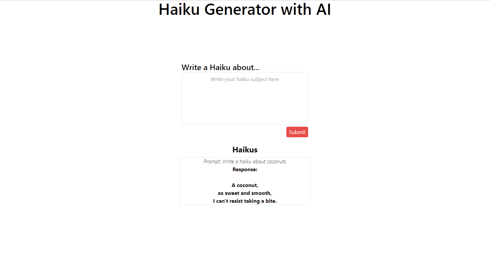

# Haiku-Generator-Shopify

## Purpose
(Front-end intern challenge)[https://docs.google.com/document/d/1O7mCynsz_cBXkEaCFGSZAuvAOY84QVq35l20xJwjOYg/edit] To write an app that sends plain text prompts to the OpenAi API and displays the results in a list.

## Acceptance Criteria
- Results should come from OpenAI’s completions API, for which you’ll need a free API key.
- Each result should include at least the original prompt you entered and the response from the API.
- Responses should be stored in order of newest to oldest.
- The HTML that ends up being served client-side should be accessible and semantic.

## Screenshot

